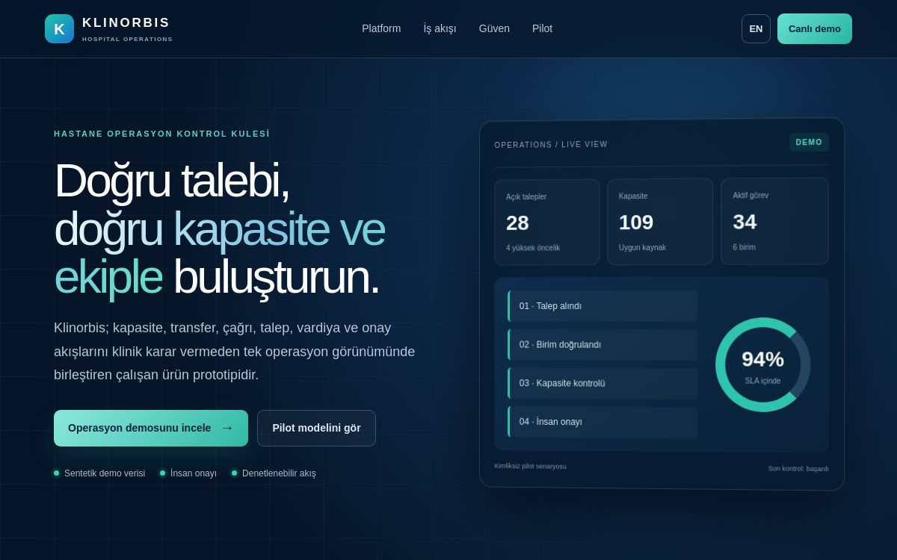

# KLINORBIS

**Hastane operasyonları için kapasite, sevk, vardiya ve iş akışı kontrol kulesi.**

[Canlı ürün vitrini](https://klinorbis.ekremalan.chatgpt.site/) · [Etkileşimli demo](https://klinorbis.ekremalan.chatgpt.site/demo) · [English README](README.en.md) · [Güvenlik](SECURITY.md)



**İnceleme yolu:** Ürün sayfası → sentetik verili demo → iş akışı ve kontrollü pilot kapsamı. Görsel canlı ürün vitrininden alınmıştır; ekrandaki örnek sayılar hastane ölçümü değildir.

> Bu depo profesyonel portföy ve teknik inceleme amacıyla yayımlanır. Canlı demo yalnızca sentetik, kimliksiz veri kullanır; klinik karar desteği veya tıbbi tanı sistemi değildir.

## Ürün özeti

KLINORBIS; hastanelerde kapasite, birimler arası sevk, vardiya devri, çağrı/iş emri ve operasyon raporlarını tek merkezde görünür kılan bir operasyon yönetimi prototipidir. Yetki ve birim kapsamı, denetim izi, idempotent zamanlanmış işler ve kontrollü rapor dışa aktarma gibi üretim odaklı yapı taşları içerir.

### Öne çıkan yetenekler

- Birim bazlı kapasite ve iş kuyruğu görünümü
- Gerekçeli ön kabul, ret ve alternatif kampüs yönlendirme akışı
- Transfer, vardiya/devretme ve zamanlanmış raporlama
- Rol ve birim kapsamlı çalışma alanı
- Yetkili CSV dışa aktarma ve denetim kaydı
- Mobil, tablet ve masaüstüne uyumlu arayüz
- Sentetik verili, herkese açık etkileşimli demo

### Teknoloji

Vinext, React, TypeScript, Cloudflare Workers/D1, Drizzle ORM ve GitHub uyumlu sürümleme yapısı kullanılır.

## Sınırlar

- Demo gerçek hasta verisi içermez.
- Klinik uygunluk, tanı veya tedavi kararı vermez.
- HBYS, PBX ve n8n bağlantıları yapılandırılmadıkça bağlıymış gibi gösterilmez.
- Gerçek sağlık kuruluşu kullanımı öncesinde kurum güvenlik incelemesi, KVKK/GDPR değerlendirmesi, entegrasyon doğrulaması ve pilot kabulü gerekir.

## Kaynak ve canlı sürüm

GitHub deposu teknik inceleme ve portföy kaynağıdır. Canlı demo ayrı Sites kaynağından yayımlanır; yalnızca depo `main` dalının varlığı, canlı yayında birebir aynı commit'in çalıştığını kanıtlamaz. Sürüm doğrulaması Sites yayın kaydı ve GitHub commit'i karşılaştırılarak yapılır. Güvenlik durum ekranındaki doğrulanmamış kontroller bağımsız denetim yerine geçmez.

---

## Technical documentation

KLINORBIS is a hospital-operations control tower running on
[vinext](https://github.com/cloudflare/vinext), Cloudflare Workers, D1 and
Drizzle. It combines unit-scoped work queues with continuous capacity,
system-to-system transfer, shift/handoff and scheduled reporting workflows.

The current deployment is an explicitly labelled, identity-free pilot. It can
automatically issue an operational capacity pre-acceptance, a reasoned capacity
rejection or an alternative-campus routing decision. It does not make clinical
suitability, diagnosis or treatment decisions and does not claim that an HBYS,
PBX or external n8n server is connected when it is not.

## Prerequisites

- Node.js `>=22.13.0`
- Linux with `flock`, `curl`, and GNU `timeout`

## Sites Lifecycle

The Sites lifecycle CLI runs the locked dependency install before returning this checkout. Edit the source under `app/`, then checkpoint when a coherent milestone is ready to inspect or share. The remote Sites builder runs `npm run build` against the pushed commit. Do not repeat install or build as a normal pre-checkpoint step.

This starter does not use `wrangler.jsonc`.

`install:ci` is intentionally a single, non-retrying `npm ci`. It refuses a concurrent install for the same project, consumes a matching image-seeded npm cache with `--prefer-offline` while retaining registry fallback for a missing cache object, otherwise downloads and verifies the complete vinext tarball recorded in `package-lock.json`, limits npm to one socket, and terminates a stalled install. `build` applies a short timeout and then validates the Sites artifact. These helpers target Linux and use GNU `timeout`; they are not native macOS scripts.

Scripts that need writable project-scoped home, npm, XDG, and temporary paths use `scripts/sites-env.sh`. The `dev` and `start` scripts honor the caller's runtime environment and keep Wrangler logs inside the checkout. The generated `.sites-runtime/` directory is disposable and ignored by Git.

## Included Shape

- continuously advancing capacity and transfer orchestration under `lib/control-tower.ts`
- persistent facilities, capacity snapshots, transfer requests, shifts and report assignments in `db/schema.ts`
- a role- and unit-scoped operational snapshot in `lib/operations.ts`
- mobile, tablet, iPad and desktop workspaces under `app/`
- authorized CSV reporting with an audit record under `app/api/reports/export/`
- scheduled Worker execution plus idempotent jobs, retry and dead-letter handling
- `app/chatgpt-auth.ts` provides optional dispatch-owned ChatGPT sign-in helpers
- `.openai/hosting.json` declares optional Sites D1 and R2 bindings
- `vite.config.ts` simulates declared bindings for local development
- `db/index.ts` reads the D1 binding from the Cloudflare Worker environment
- `drizzle.config.ts` supports local migration generation when needed

## Workspace Auth Headers

OpenAI workspace sites can read the current user's email from
`oai-authenticated-user-email`.

SIWC-authenticated workspace sites may also receive
`oai-authenticated-user-full-name` when the user's SIWC profile has a non-empty
`name` claim. The full-name value is percent-encoded UTF-8 and is accompanied by
`oai-authenticated-user-full-name-encoding: percent-encoded-utf-8`.

Treat the full name as optional and fall back to email when it is absent:

```tsx
import { headers } from "next/headers";

export default async function Home() {
  const requestHeaders = await headers();
  const email = requestHeaders.get("oai-authenticated-user-email");
  const encodedFullName = requestHeaders.get("oai-authenticated-user-full-name");
  const fullName =
    encodedFullName &&
    requestHeaders.get("oai-authenticated-user-full-name-encoding") ===
      "percent-encoded-utf-8"
      ? decodeURIComponent(encodedFullName)
      : null;

  const displayName = fullName ?? email;
  // ...
}
```

## Optional Dispatch-Owned ChatGPT Sign-In

Import the ready-to-use helpers from `app/chatgpt-auth.ts` when the site needs
optional or required ChatGPT sign-in:

- Use `getChatGPTUser()` for optional signed-in UI.
- Use `requireChatGPTUser(returnTo)` for server-rendered pages that should send
  anonymous visitors through Sign in with ChatGPT.
- Use `chatGPTSignInPath(returnTo)` and `chatGPTSignOutPath(returnTo)` for
  browser links or actions.
- Pass a same-origin relative `returnTo` path for the destination after sign-in
  or sign-out. The helper validates and safely encodes it.
- Mark protected pages with `export const dynamic = "force-dynamic"` because
  they depend on per-request identity headers.

Dispatch owns `/signin-with-chatgpt`, `/signout-with-chatgpt`, `/callback`, the
OAuth cookies, and identity header injection. Do not implement app routes for
those reserved paths. Routes that do not import and call the helper remain
anonymous-compatible.

SIWC establishes identity only; it does not prove workspace membership. Use the
Sites hosting platform's access policy controls for workspace-wide restrictions,
or enforce explicit server-side membership or allowlist checks.

Use SIWC for account pages, user-specific dashboards, saved records, and write
actions tied to the current ChatGPT user. Leave public content anonymous.

## Diagnostic Commands

- `npm run install:ci`: perform the one bounded lockfile install
- `npm run dev`: start the Vite/Vinext development server
- `npm run build`: build and validate the deployable Sites artifact
- `npm run start`: start the built Vinext application
- `npm test`: build, validate, and verify the rendered development-preview metadata
- `npm run validate:artifact`: recheck an existing artifact's manifest and ESM `default.fetch` export
- `npm run db:generate`: generate Drizzle migrations after schema changes

Use build and validation commands for targeted diagnosis after a remote failure, not as part of the normal checkpoint path.

The timeout defaults can be overridden for a controlled canary with `SITES_INSTALL_TIMEOUT`, `SITES_INSTALL_KILL_AFTER`, `SITES_BUILD_TIMEOUT`, and `SITES_BUILD_KILL_AFTER`. A timeout fails the command; the helpers never retry an unchanged install or build.

## Learn More

- [vinext Documentation](https://github.com/cloudflare/vinext)
- [Drizzle D1 Guide](https://orm.drizzle.team/docs/get-started/d1-new)
